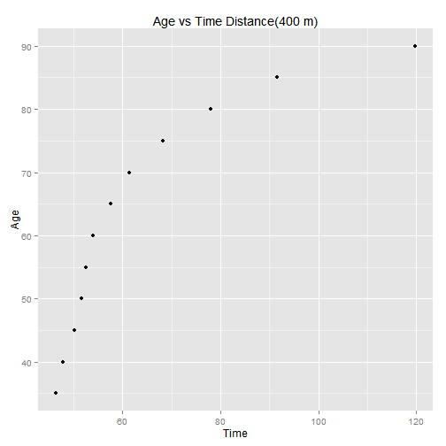

##  Slide 1

Documentation on the Application (world records in track and field running events for various distances and different age groups.) 

--- 

## Slide 2

UsingR is a collection of data sets to accompany the textbook :Using R for Introductory Statistics . I have used best.times data base, which is part of UsingR dataset. Best.times is data base, of world records in track and field running events for various distances and different age groups. 

---

## Slide 3

best.times has 113 observations on the following 6 variables : Dist Distance in meters (42195 is a marathon),Name : Name of record holder,Date : Date of record,Time : Time in seconds,Time.1 : Time as character,age : Age at time of record.

---

 

---

## Slide 5

The plot on the previous slide, is Age vs Time for Distance of 400 m. We can see that as the age increases, the time taken to cover the distance also increases.
